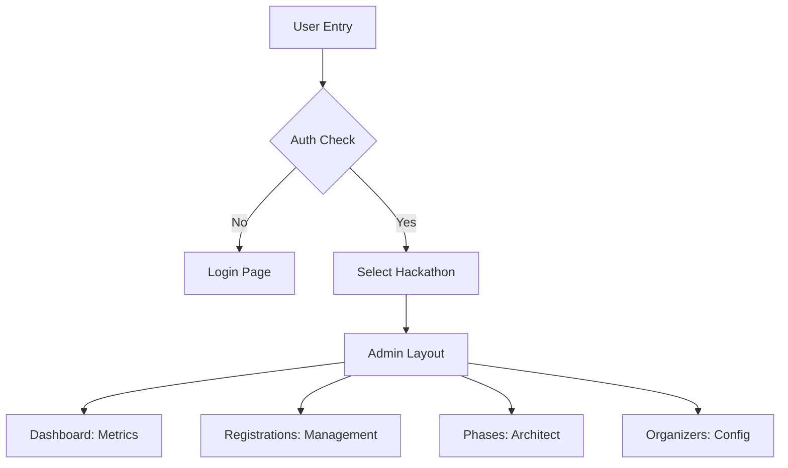

# 🛠️ CodeCraft Admin Portal

The administrative command center for CodeCraft. A high-performance, reactive dashboard built with Vite, React, and TanStack Router, designed for real-time hackathon management and participant oversight.


---

## 📂 Project Structure

| Path | Description |
| :--- | :--- |
| `src/main.tsx` | Application entry point. |
| `src/router.tsx` | Centralized route definitions using TanStack Router. |
| `src/pages/` | High-level page components (Dashboard, Registrations, etc.). |
| `src/components/` | Reusable UI components and layouts. |
| `src/lib/` | Utility functions and service initializations (Firebase). |
| `src/assets/` | Static assets and styling tokens. |

---

## 🛠️ Way of Working (Logic Flow)



---

## ⚡ Quick Start

1. **Install Dependencies**

   ```bash
   npm install
   ```

2. **Run Development Server**

   ```bash
   npm run dev
   ```

3. **Build for Production**

   ```bash
   npm run build
   ```

---

## 🔑 Key Features

- **Phase Architect**: Customize hackathon phases dynamically.
- **Real-time Metrics**: Track registrations and submissions via Firebase.
- **Team Management**: Oversee participant groupings and details.
- **Asset Handling**: Integrated image cropping and Cloudinary uploads.
