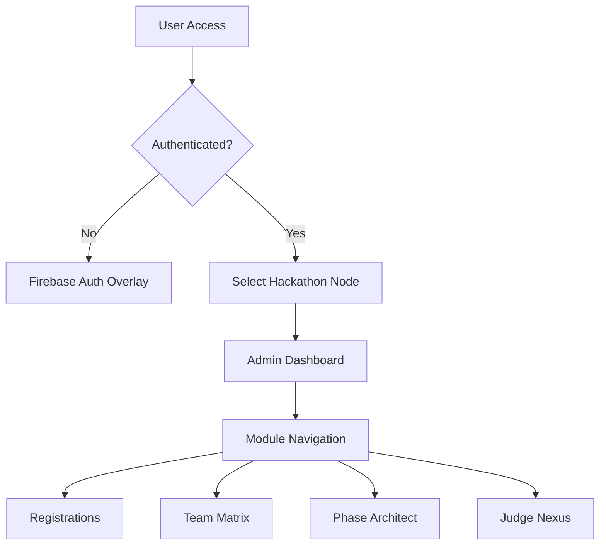

# 🛡️ CodeCraft Admin Terminal


The **CodeCraft Admin Terminal** is a high-performance command center built for hackathon organizers. It features a bespoke "Cyber-UI" aesthetic with immersive animations, real-time data synchronization, and a robust routing system.

---

## 🛠️ Tech Stack

- **Core**: React 19 (Functional Components & Hooks)
- **Routing**: `@tanstack/react-router` (Type-safe routing)
- **Styling**: Vanilla CSS + TailwindCSS (Cyberpunk theme)
- **Backend Sync**: Firebase Auth & Firestore + Custom REST API
- **State Management**: React State & Context

---

## 📂 Repository Structure

| Path | Purpose |
| :--- | :--- |
| `src/pages/` | Core views (Dashboard, Registrations, Teams, etc.) |
| `src/components/` | Reusable UI components and the main `AdminLayout` |
| `src/components/ui/` | Atomic UI elements like the `Loader` |
| `src/assets/` | Static media assets and vector graphics |
| `src/lib/` | Utilities for Firebase, cropping, and more |
| `src/router.tsx` | Centralized type-safe route configuration |
| `src/index.css` | Global design system and Cyber-UI animations |

---

## 🔄 Way of Working (Logic Flow)



---

## 🚀 Getting Started

1. **Install Dependencies**:

   ```bash
   npm install
   ```

2. **Run Dev Environment**:

   ```bash
   npm run dev
   ```

3. **Build for Production**:

   ```bash
   npm run build
   ```
